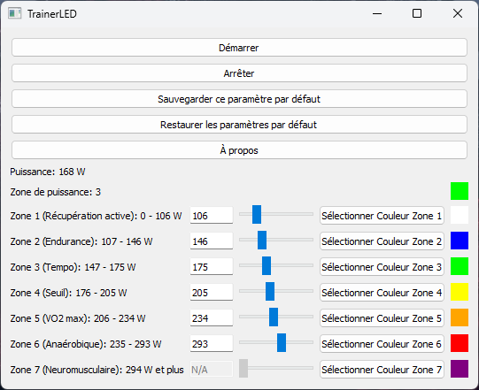

# 🚴‍♂️ TrainerLED 💡: 
## Synchronisation de la puissance du Home Trainer avec des LED RGB 💡

[](https://www.python.org/)
[](https://opensource.org/licenses/MIT)
[](https://openrgb.org/)

## 🚧 En cours de développement 🚧

En cours de développement. Les contributions et suggestions sont les bienvenues !


Ce projet permet de synchroniser la puissance de pédalage d'un home trainer avec des LED RGB en utilisant `OpenRGB` pour le contrôle des LED et `Bleak` pour la communication Bluetooth avec le home trainer.
L'idée est de visualiser les 7 zones de couleurs pour représenter les différentes plages de puissance.  

#### Le programme est testé sur un Home trainer Tacx NEO 2T et des pédales Favero Assioma DUO.
#### Pour assurer une compatibilité optimale, il est recommandé d'utiliser la connexion ANT+ pour votre logiciel virtuel (tel qu'IndieVelo, Zwift, Rouvy, etc.) et TrainerLED en Bluetooth.

  

Voici une vidéo de démonstration (cliquez sur la vignette) :

[](https://www.youtube.com/watch?v=Lh4l7ruDxWw)


## 🌟 Prérequis

Avant de commencer, assurez-vous d'avoir les éléments suivants :

- **Home Trainer Bluetooth** : Home Trainer avec capteur de puissance de cyclisme.
- **PC avec Bluetooth et Windows** : Le script est configuré pour Windows.
- **Contrôleur de LED RGB** : Compatible avec OpenRGB.

## 📥 Installation

### 1. Installer Python

Assurez-vous d'avoir Python 3.8 ou une version ultérieure installée sur votre machine. Vous pouvez le télécharger depuis [python.org](https://www.python.org/downloads/).

### 2. Installer les bibliothèques nécessaires

Utilisez `pip` pour installer les bibliothèques requises :

```sh
pip install bleak openrgb-python PyQt5
```
### 3. Configuration de OpenRGB

Téléchargez et installez [OpenRGB](https://openrgb.org/). Assurez-vous que OpenRGB fonctionne dans un premier temps.
Ensuite il faut que le serveur OpenRGB soit activé. Pour l'activer il faut aller dans les paramètres de OpenRGB et activer l'option "Enable SDK Server".

## 🔍 Trouver l'UUID et l'adresse MAC du Home Trainer

C'est la partie la plus difficile. Pour que le script fonctionne, vous devez connaître l'UUID du service et de la caractéristique de puissance, ainsi que l'adresse MAC de votre home trainer. 

Voici comment les trouver :

### Trouver l'adresse MAC

Scanner avec un outil Bluetooth :
Utilisez un outil comme Bluetooth LE Scanner sur Android ou LightBlue sur iOS.
Recherchez votre home trainer dans la liste des appareils disponibles.
Notez l'adresse MAC qui sera dans un format comme XX:XX:XX:XX:XX:XX.

### Trouver l'UUID

Utiliser un scanner Bluetooth (l'application par exemple):
Une fois votre appareil trouvé dans l'application scanner, vous pouvez afficher les services et caractéristiques disponibles.
Recherchez les services qui se rapportent à la puissance de cyclisme. 

Les UUIDs typiques sont :

Service de puissance de cyclisme : 00001818-0000-1000-8000-00805f9b34fb

Caractéristique de mesure de puissance : 00002a63-0000-1000-8000-00805f9b34fb

## 📝 Configuration du Script

### 1. Créer et copier le script

Créez un fichier TrainerLED.py et copiez le code suivant :

```
import sys
import asyncio
import threading
import time
import json
from collections import deque
from PyQt5.QtWidgets import QApplication, QWidget, QVBoxLayout, QHBoxLayout, QPushButton, QLabel, QSlider, QFrame, QColorDialog, QGridLayout, QLineEdit, QMessageBox, QDialog, QVBoxLayout
from PyQt5.QtGui import QIntValidator, QFont
from PyQt5.QtCore import QThread, pyqtSignal, QObject, Qt
from bleak import BleakClient
from openrgb import OpenRGBClient
from openrgb.utils import RGBColor

# Chemin du fichier de configuration
CONFIG_FILE = 'config.json'

# Variable globale pour arrêter le script
running = True

# Déclaration des variables pour la puissance et la couleur
power_values = deque(maxlen=10)
last_update_time = time.time()
current_color = RGBColor(0, 0, 0)
color_lock = threading.Lock()

# UUID et adresse MAC du home trainer
SERVICE_UUID = '00001818-0000-1000-8000-00805f9b34fb'
CHARACTERISTIC_UUID = '00002a63-0000-1000-8000-00805f9b34fb'
HOME_TRAINER_MAC = 'XX:XX:XX:XX:XX:XX'

# Classe pour gérer les notifications de puissance dans un thread séparé
class PowerNotificationHandler(QObject):
    power_updated = pyqtSignal(int)
    color_updated = pyqtSignal(tuple)

    def __init__(self):
        super().__init__()
        self.zone_thresholds, self.zone_colors = self.load_config()

    def load_config(self):
        try:
            with open(CONFIG_FILE, 'r') as f:
                config = json.load(f)
                zone_thresholds = config['thresholds']
                zone_colors = [tuple(color) for color in config['colors']]
                return zone_thresholds, zone_colors
        except (FileNotFoundError, KeyError, ValueError):
            return [106, 146, 175, 205, 234, 293], [
                (255, 255, 255),  # Default color for zone 1
                (0, 0, 255),      # Default color for zone 2
                (0, 255, 0),      # Default color for zone 3
                (255, 255, 0),    # Default color for zone 4
                (255, 165, 0),    # Default color for zone 5
                (255, 0, 0),      # Default color for zone 6
                (128, 0, 128)     # Default color for zone 7
            ]

    def save_config(self):
        config = {
            'thresholds': self.zone_thresholds,
            'colors': [list(color) for color in self.zone_colors]
        }
        with open(CONFIG_FILE, 'w') as f:
            json.dump(config, f)

    def restore_default_config(self):
        self.zone_thresholds = [106, 146, 175, 205, 234, 293]
        self.zone_colors = [
            (255, 255, 255),  # Default color for zone 1
            (0, 0, 255),      # Default color for zone 2
            (0, 255, 0),      # Default color for zone 3
            (255, 255, 0),    # Default color for zone 4
            (255, 165, 0),    # Default color for zone 5
            (255, 0, 0),      # Default color for zone 6
            (128, 0, 128)     # Default color for zone 7
        ]
        self.save_config()

    def get_zone_ranges(self):
        ranges = []
        lower_bound = 0
        for threshold in self.zone_thresholds:
            ranges.append((lower_bound, threshold))
            lower_bound = threshold + 1
        ranges.append((lower_bound, float('inf')))  # Last range is open-ended
        return ranges

    def set_zone_threshold(self, index, value):
        self.zone_thresholds[index] = value
        self.save_config()

    def set_zone_color(self, index, color):
        self.zone_colors[index] = color
        self.save_config()

    def handle_notification(self, sender, data):
        global last_update_time
        try:
            puissance = int.from_bytes(data[2:4], byteorder='little')
            last_update_time = time.time()
            power_values.append(puissance)

            if len(power_values) == power_values.maxlen:
                avg_puissance = sum(power_values) / len(power_values)
                self.power_updated.emit(int(avg_puissance))

                for i, threshold in enumerate(self.zone_thresholds):
                    if avg_puissance <= threshold:
                        new_color = self.zone_colors[i]
                        zone = i + 1
                        break
                else:
                    new_color = self.zone_colors[-1]
                    zone = len(self.zone_colors)

                self.color_updated.emit((new_color, zone))
                threading.Thread(target=set_led_color_with_transition, args=new_color).start()
        except Exception as e:
            print(f"Erreur lors de la gestion des données de puissance: {e}")

# Fonction pour définir la couleur des LED avec transition
def set_led_color_with_transition(r, g, b, steps=10, delay=0.01):
    global current_color
    try:
        client = OpenRGBClient('localhost', 6742)
        devices = client.devices

        with color_lock:
            current_r = current_color.red
            current_g = current_color.green
            current_b = current_color.blue

        step_r = (r - current_r) / steps
        step_g = (g - current_g) / steps
        step_b = (b - current_b) / steps

        for i in range(steps):
            new_r = int(current_r + step_r * i)
            new_g = int(current_g + step_g * i)
            new_b = int(current_b + step_b * i)
            color = RGBColor(new_r, new_g, new_b)

            with color_lock:
                current_color = color
                for device in devices:
                    device.set_color(color)
            time.sleep(delay)

        final_color = RGBColor(r, g, b)
        with color_lock:
            current_color = final_color
            for device in devices:
                device.set_color(final_color)
    except Exception as e:
        print(f"Erreur de connexion à OpenRGB: {e}")

# Fonction principale pour se connecter et lire les données de puissance
async def main(notification_handler):
    global last_update_time, running
    async with BleakClient(HOME_TRAINER_MAC) as client:
        await client.start_notify(CHARACTERISTIC_UUID, notification_handler.handle_notification)
        try:
            while running:
                if time.time() - last_update_time > 10:
                    print("Aucune donnée reçue depuis 10 secondes, attente de nouvelles données...")
                await asyncio.sleep(1)
        except asyncio.CancelledError:
            print("Tâche annulée.")
        except KeyboardInterrupt:
            running = False
            print("Interruption reçue, arrêt du script...")
        finally:
            await client.stop_notify(CHARACTERISTIC_UUID)

# Thread pour exécuter la boucle asyncio
class AsyncThread(QThread):
    def __init__(self, notification_handler):
        super().__init__()
        self.notification_handler = notification_handler

    def run(self):
        loop = asyncio.new_event_loop()
        asyncio.set_event_loop(loop)
        loop.run_until_complete(main(self.notification_handler))

# Interface graphique
class MainWindow(QWidget):
    def __init__(self):
        super().__init__()

        self.notification_handler = PowerNotificationHandler()
        self.notification_handler.power_updated.connect(self.update_power)
        self.notification_handler.color_updated.connect(self.update_color)

        self.init_ui()
        self.async_thread = AsyncThread(self.notification_handler)

    def init_ui(self):
        self.setWindowTitle('TrainerLED')
        self.layout = QVBoxLayout()

        self.start_button = QPushButton('Démarrer')
        self.stop_button = QPushButton('Arrêter')
        self.save_default_button = QPushButton('Sauvegarder ce paramètre par défaut')
        self.restore_default_button = QPushButton('Restaurer les paramètres par défaut')
        self.about_button = QPushButton('À propos')
        self.power_label = QLabel('Puissance: N/A')
        self.zone_label = QLabel('Zone de puissance: N/A')
        self.color_frame = QFrame()
        self.color_frame.setFixedSize(20, 20)  # Taille des autres cases de couleur
        self.color_frame.setStyleSheet("background-color: rgb(0, 0, 0);")

        self.start_button.clicked.connect(self.start_thread)
        self.stop_button.clicked.connect(self.stop_thread)
        self.save_default_button.clicked.connect(self.save_defaults)
        self.restore_default_button.clicked.connect(self.restore_defaults)
        self.about_button.clicked.connect(self.show_about_dialog)

        power_zone_layout = QHBoxLayout()
        power_zone_layout.addWidget(self.zone_label)
        power_zone_layout.addWidget(self.color_frame)

        self.layout.addWidget(self.start_button)
        self.layout.addWidget(self.stop_button)
        self.layout.addWidget(self.save_default_button)
        self.layout.addWidget(self.restore_default_button)
        self.layout.addWidget(self.about_button)
        self.layout.addWidget(self.power_label)
        self.layout.addLayout(power_zone_layout)

        grid_layout = QGridLayout()

        self.sliders = []
        self.color_buttons = []
        self.color_frames = []
        self.threshold_edits = []
        self.range_labels = []

        zone_names = [
            "Récupération active", "Endurance", "Tempo", "Seuil", 
            "VO2 max", "Anaérobique", "Neuromusculaire"
        ]

        for i in range(6):
            range_label = QLabel()
            threshold_edit = QLineEdit(str(self.notification_handler.zone_thresholds[i]))
            threshold_edit.setFixedWidth(50)
            threshold_edit.setValidator(QIntValidator(0, 500))
            threshold_edit.editingFinished.connect(self.create_threshold_edit_handler(i, threshold_edit, range_label))

            slider = QSlider(Qt.Horizontal)
            slider.setMinimum(0)
            slider.setMaximum(500)
            slider.setValue(self.notification_handler.zone_thresholds[i])
            slider.valueChanged.connect(self.create_slider_change_handler(i, threshold_edit, range_label))

            color_button = QPushButton(f'Sélectionner Couleur Zone {i + 1}')
            color_button.clicked.connect(self.create_color_change_handler(i))

            color_frame = QFrame()
            color_frame.setFixedSize(20, 20)
            color_frame.setStyleSheet(f"background-color: rgb({self.notification_handler.zone_colors[i][0]}, {self.notification_handler.zone_colors[i][1]}, {self.notification_handler.zone_colors[i][2]});")

            self.sliders.append(slider)
            self.color_buttons.append(color_button)
            self.color_frames.append(color_frame)
            self.threshold_edits.append(threshold_edit)
            self.range_labels.append(range_label)

            grid_layout.addWidget(range_label, i, 0, 1, 2)
            grid_layout.addWidget(threshold_edit, i, 2)
            grid_layout.addWidget(slider, i, 3)
            grid_layout.addWidget(color_button, i, 4)
            grid_layout.addWidget(color_frame, i, 5)

        # Ajout de la sélection de couleur pour la zone 7
        range_label_7 = QLabel()
        threshold_edit_7 = QLineEdit('N/A')
        threshold_edit_7.setFixedWidth(50)
        threshold_edit_7.setEnabled(False)

        color_button_7 = QPushButton(f'Sélectionner Couleur Zone 7')
        color_button_7.clicked.connect(self.create_color_change_handler(6))

        color_frame_7 = QFrame()
        color_frame_7.setFixedSize(20, 20)
        color_frame_7.setStyleSheet(f"background-color: rgb({self.notification_handler.zone_colors[6][0]}, {self.notification_handler.zone_colors[6][1]}, {self.notification_handler.zone_colors[6][2]});")

        slider_7 = QSlider(Qt.Horizontal)
        slider_7.setMinimum(0)
        slider_7.setMaximum(500)
        slider_7.setValue(0)
        slider_7.setEnabled(False)  # Désactiver le curseur pour la zone 7

        grid_layout.addWidget(range_label_7, 6, 0, 1, 2)
        grid_layout.addWidget(threshold_edit_7, 6, 2)
        grid_layout.addWidget(slider_7, 6, 3)
        grid_layout.addWidget(color_button_7, 6, 4)
        grid_layout.addWidget(color_frame_7, 6, 5)

        self.color_frames.append(color_frame_7)
        self.range_labels.append(range_label_7)
        self.layout.addLayout(grid_layout)

        self.update_ranges()

        self.setLayout(self.layout)

    def create_slider_change_handler(self, index, threshold_edit, range_label):
        def handler(value):
            threshold_edit.setText(str(value))
            self.notification_handler.set_zone_threshold(index, value)
            self.update_ranges()
        return handler

    def create_threshold_edit_handler(self, index, threshold_edit, range_label):
        def handler():
            value = int(threshold_edit.text())
            self.sliders[index].setValue(value)
            self.notification_handler.set_zone_threshold(index, value)
            self.update_ranges()
        return handler

    def create_color_change_handler(self, index):
        def handler():
            color = QColorDialog.getColor()
            if color.isValid():
                rgb = (color.red(), color.green(), color.blue())
                self.notification_handler.set_zone_color(index, rgb)
                self.color_frames[index].setStyleSheet(f"background-color: rgb({rgb[0]}, {rgb[1]}, {rgb[2]});")
        return handler

    def start_thread(self):
        global running
        running = True
        self.async_thread.start()
        # Définir les LED à la couleur de la zone 1
        zone_1_color = self.notification_handler.zone_colors[0]
        threading.Thread(target=set_led_color_with_transition, args=zone_1_color).start()

    def stop_thread(self):
        global running
        running = False
        self.async_thread.quit()
        # Éteindre les LED (définir à noir)
        threading.Thread(target=set_led_color_with_transition, args=(0, 0, 0)).start()

    def update_power(self, power):
        self.power_label.setText(f'Puissance: {power} W')

    def update_color(self, color_zone):
        color, zone = color_zone
        self.zone_label.setText(f'Zone de puissance: {zone}')
        self.color_frame.setStyleSheet(f"background-color: rgb({color[0]}, {color[1]}, {color[2]});")

    def update_ranges(self):
        ranges = self.notification_handler.get_zone_ranges()
        zone_names = [
            "Récupération active", "Endurance", "Tempo", "Seuil", 
            "VO2 max", "Anaérobique", "Neuromusculaire"
        ]
        for i, (low, high) in enumerate(ranges):
            zone_name = zone_names[i]
            if high == float('inf'):
                range_text = f'Zone {i + 1} ({zone_name}): {low} W et plus'
            else:
                range_text = f'Zone {i + 1} ({zone_name}): {low} - {high} W'
            self.range_labels[i].setText(range_text)

    def save_defaults(self):
        self.notification_handler.save_config()

    def restore_defaults(self):
        self.notification_handler.restore_default_config()
        self.update_ranges()
        for i in range(6):
            self.sliders[i].setValue(self.notification_handler.zone_thresholds[i])
            self.color_frames[i].setStyleSheet(f"background-color: rgb({self.notification_handler.zone_colors[i][0]}, {self.notification_handler.zone_colors[i][1]}, {self.notification_handler.zone_colors[i][2]});")
        self.color_frames[6].setStyleSheet(f"background-color: rgb({self.notification_handler.zone_colors[6][0]}, {self.notification_handler.zone_colors[6][1]}, {self.notification_handler.zone_colors[6][2]});")

    def show_about_dialog(self):
        dialog = QDialog(self)
        dialog.setWindowTitle("À propos de TrainerLED")
        layout = QVBoxLayout()
        label = QLabel(
            "<p>TrainerLED</p>"
            "<p>Cette application permet de contrôler la puissance et les LED de votre home trainer via Bluetooth, "
            "et d'afficher différentes zones de puissance avec des couleurs configurables.</p>"
            "<p>Pour plus d'informations, visitez notre dépôt GitHub : "
            "<a href='https://github.com/nicolasjouffroy/TrainerLED'>TrainerLED</a></p>"
        )
        label.setOpenExternalLinks(True)
        label.setWordWrap(True)
        layout.addWidget(label)
        dialog.setLayout(layout)
        dialog.exec_()

if __name__ == '__main__':
    app = QApplication(sys.argv)
    window = MainWindow()
    window.show()
    sys.exit(app.exec_())
```

## ⚙️Configuration

### Configurer le script :
Pensez à éditer le script TrainerLED.py et remplacez les valeurs des variables HOME_TRAINER_MAC, SERVICE_UUID, et CHARACTERISTIC_UUID par celles de votre home trainer.

## 🚴‍♂️ Utilisation

### Exécuter le script :
Ouvrez un terminal et exécutez le script :
```
python TrainerLED.py
```

### ⚡Réglages des Zones de Puissance

L'application permet de définir sept zones de puissance, chacune associée à une couleur différente.

Voici les étapes pour configurer ces zones :  

- **Démarrer l'application** : Cliquez sur le bouton Démarrer.  
- **Arrêter l'application** : Cliquez sur le bouton Arrêter.

Vous pouvez ajuster les seuils de puissance pour chaque zone à l'aide des curseurs ou en entrant manuellement les valeurs :  

- **Zone 1** (Récupération active) : Réglage de 0 à zone 1.  
- **Zone 2** (Endurance) : Réglage zone 1 + à zone 2.  
- **Zone 3** (Tempo) : Réglage de zone 2 +  à zone 3.  
- **Zone 4** (Seuil) : Réglage de zone 3 + 1 à zone 4.  
- **Zone 5** (VO2 max) : Réglage de zone 4 + à zone 5.  
- **Zone 6** (Anaérobique) : Réglage de zone 5 + à zone 6.  
- **Zone 7** (Neuromusculaire) : Réglage de zone 6 + au-delà.  

### 🎨 Couleurs des Zones

Pour chaque zone, vous pouvez choisir une couleur en cliquant sur le bouton Sélectionner Couleur Zone X et en choisissant la couleur souhaitée à partir du sélecteur de couleur.   

Sauvegarder et Restaurer les Paramètres :  

- Sauvegarder ce paramètre par défaut : Cliquez sur ce bouton pour sauvegarder les seuils et les couleurs actuels comme paramètres par défaut.  
- Restaurer les paramètres par défaut : Cliquez sur ce bouton pour restaurer les seuils et les couleurs par défaut.  

### Exemple d'Utilisation

**1** - Démarrez l'application en cliquant sur Démarrer.  
**2** - Ajustez les seuils de puissance en utilisant les curseurs ou en entrant les valeurs manuellement.  
**3** - Sélectionnez les couleurs pour chaque zone en cliquant sur les boutons de sélection de couleur.  
**4** - Sauvegardez vos réglages en cliquant sur Sauvegarder ce paramètre par défaut.  
**5** - Arrêtez l'application en cliquant sur Arrêter.  

Les LED devraient maintenant changer de couleur en fonction de la puissance moyenne sur 1 seconde mesurée par le home trainer.  

## 📌 Contribution

Les contributions sont les bienvenues ! Si vous avez des idées d'améliorations ou si vous rencontrez des problèmes, n'hésitez pas à ouvrir une issue ou à soumettre une pull request.

## 📝 Licence

Ce projet est sous licence MIT. Voir le fichier LICENSE pour plus d'informations.

